# Flat World

[](LICENSE)
[](https://www.python.org/)

**English** | [中文](#flat-world-中文)

Warp-accelerated **2D** physics engine with **explicit FEM**, **impulse-based rigid bodies**, and **mixed-domain contact** (analytical ground, height fields, voxel maps).

## Features

- **FEM / soft bodies** — explicit dynamics, linear elastic / Neo-Hookean / J2 plasticity
- **Rigid bodies** — ball, box, capsule, mesh; 2D SAT; PGS impulses
- **Ground types** — `GroundDomain` (plane), `HeightFieldDomain`, `VoxelGridDomain`; rigid and FEM contacts run as batched Warp kernels
- **Joints** — revolute, weld, prismatic, spherical
- **GPU batching** — unified FEM / spring manager + `MixedContact` penalty kernels

## Quick start

```bash
git clone https://github.com/swaggyliu/FlatWorld.git
cd FlatWorld
pip install -r requirements.txt
pip install -e .
```

```python
import numpy as np
from flatworld import Mesh, FemDomain, SolidProp, Elastic, Gravity, ExplicitLoop, GroundDomain
from flatworld.wp_init import ensure_warp

ensure_warp()

conn = np.array([[0, 1, 3], [0, 3, 2]], dtype=np.int32)
coords = np.array([[0.5, 0.5], [0.7, 0.5], [0.5, 0.7], [0.7, 0.7]], dtype=np.float32)
mesh = Mesh(2, conn, coords)
domain = FemDomain(mesh, SolidProp(Elastic(E=2e4, nu=0.2, rho=40.0)), bcs=[Gravity([0, -1.0])])
ground = GroundDomain(2, [0, 0.0], [0, 1])

looper = ExplicitLoop(0.0, [domain, ground], useAdapativeDT=True)
for _ in range(60):
    looper.advanceWithTime(1.0 / 60.0)
```

`.msh` / `.vtu` meshes go through `FEMesher` and need **meshio** (`pip install meshio`). The Spirit Push game needs **raylib**.

## Tests

```bash
# Headless (recommended for CI)
set HEADLESS=1          # Windows
export HEADLESS=1       # Linux / macOS
pytest test2D -q

# With GUI when a display is available
pytest test2D/test_2Dfem_elastic.py
```

51 pytest modules under `test2D/` cover FEM, rigid contact, joints, friction, and all ground types.

## Learning world models

Full write-up, architecture, losses, and eval numbers:
**[learning/README.md](learning/README.md)**.

[`learning/`](learning/README.md) is a lightweight **state + tactile
conditioned latent world model** (StateLeWM) trained inside FlatWorld:
random-push data collection, latent dynamics training, and CEM planning
for PushToGoal. **320K** parameters. Current numbers (50 episodes, CEM H=32): leftmost
**98%**, rightmost **96%**, random **96%**. The same recipe transfers to
two-room traversal (**49/50 = 98%**) and a gravity two-link reacher
(**48/50 = 96%**). Shipped weights:
`learning/checkpoints/push_game/best.pt`.

<p align="center">
  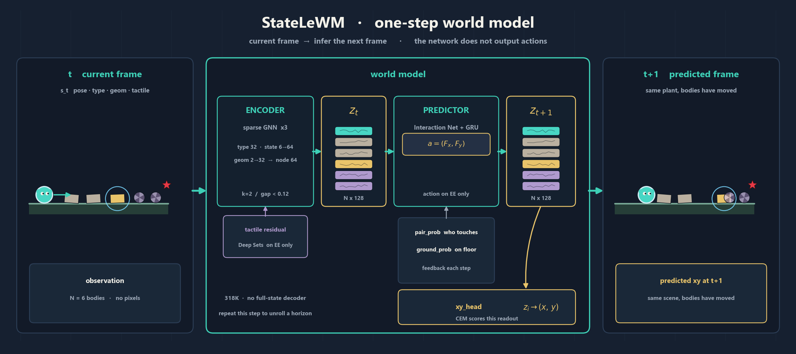
</p>

<p align="center">
  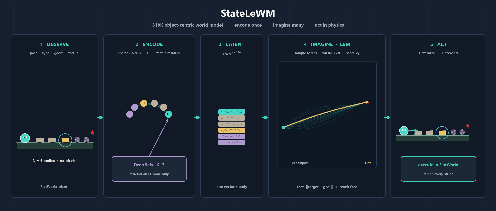
</p>

### Two more cases of the same recipe: Two-room and Reacher

**Two-room** and **Reacher** are two further cases of the same LeWM recipe —
learn a latent world model from goal-free interaction, then plan with CEM — not
new architectures. They reuse the identical StateLeWM encoder/predictor/losses:
only the *data* and a typed-edge + (x, y, θ) readout changed. Two-room is a
walled arena with a ~0.40 m doorway; the goal always sits in the room the EE
did **not** start in, so the planner has to find the door itself. Reacher is a
gravity two-link arm whose actions are PD joint-angle targets.

| scene | success (50 ep, seed 1000) | tol / vel | weights |
|-------|----------------------------|-----------|---------|
| PushToGoal (leftmost / rightmost / random) | 98 / 96 / 96 % | 0.08 m / 0.08 m/s | `learning/checkpoints/push_game` |
| Two-room | **49/50 = 98%** | 0.10 m / 0.15 m/s | `learning/checkpoints/two_room` |
| Reacher | **48/50 = 96%** | 0.06 m / 0.18 m/s | `learning/checkpoints/reacher` |

Two-room and Reacher are exactly the two benchmark tasks used by the pixel-based
LeWM line, so the task names line up and the success rates can be put side by side:

| method | Two-Room | Reacher |
|--------|----------|---------|
| **StateLeWM** (this repo — state + EE tactile) | **98** | **96** |
| LeWM | 87 | 86 |
| Fast-LeWM | 98 | 88 |
| DINO-WM | 100 | 79 |
| PLDM | 97 | 78 |

Success %. The StateLeWM row is measured here (50 / 10 episodes);
the LeWM-family rows are their published numbers on *their own* Two-Room / Reacher
implementations (pixel observations, their own episode counts and success
thresholds — LeWM: Maes et al., 2026; Fast-LeWM: Gao & Xu, 2026; DINO-WM: Zhou et
al., 2025; PLDM: Sobal et al., 2025). Read it as a size anchor, not a controlled
head-to-head.

## Spirit Push

A raylib prototype that uses the world model as a **spirit**: you click
what to push and where; CEM plans the force. Five campaign stages stay
inside the trained scene (1 circular EE + 3 boxes + 2 balls). After
Gauntlet, layouts **randomize** (seeded — retry is the same mix).

```bash
python -m game
# or: python -m game --checkpoint learning/checkpoints/push_game
```

Gold is the target, red is a one-hit hazard, the star is the goal.
Sliders set bounce / grip / size.

<p align="center">
  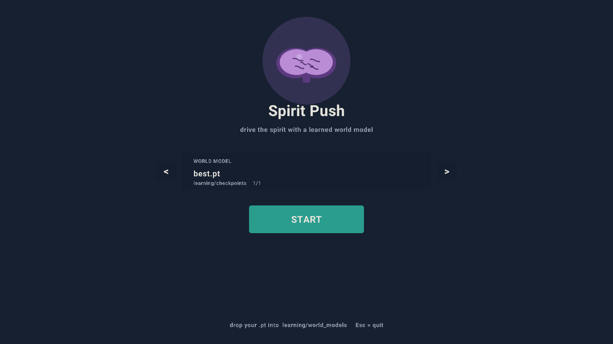
</p>

<p align="center">
  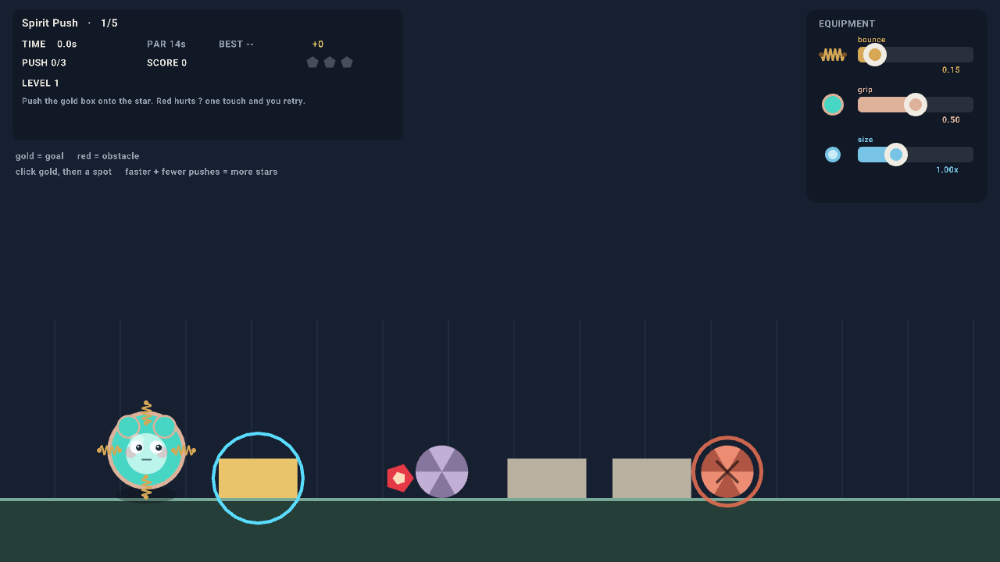
  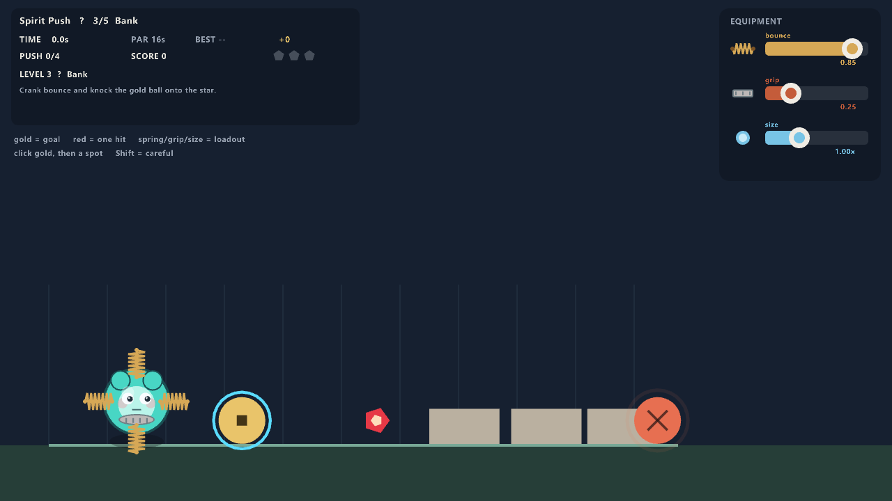
  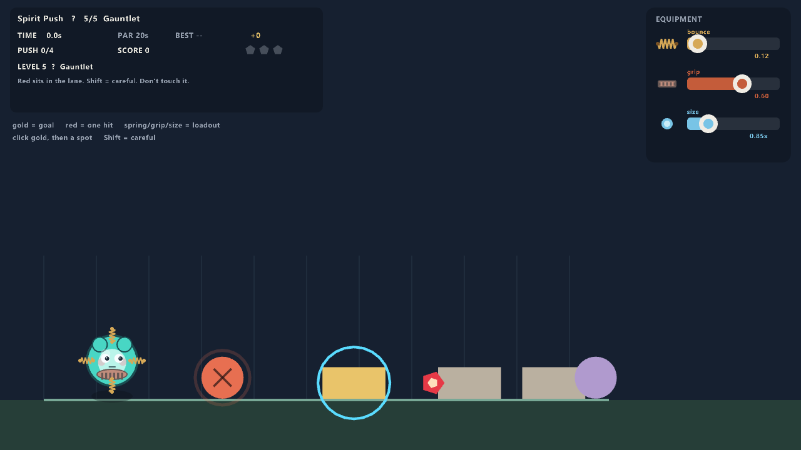
</p>

| shot | stage |
|------|--------|
| menu | pick `best.pt` (or drop your own `.pt` into `learning/world_models`) |
| Push | shove the gold box onto the star |
| Bank | high bounce, knock the gold ball |
| Gauntlet | red sits in the lane — don't touch it |

How the planner talks to the engine: [learning/README.md](learning/README.md).
Regenerate shots: `python scripts/capture_game.py`.

## Gallery

Live-rendered screenshots from `test2D` demos:

<p align="center">
  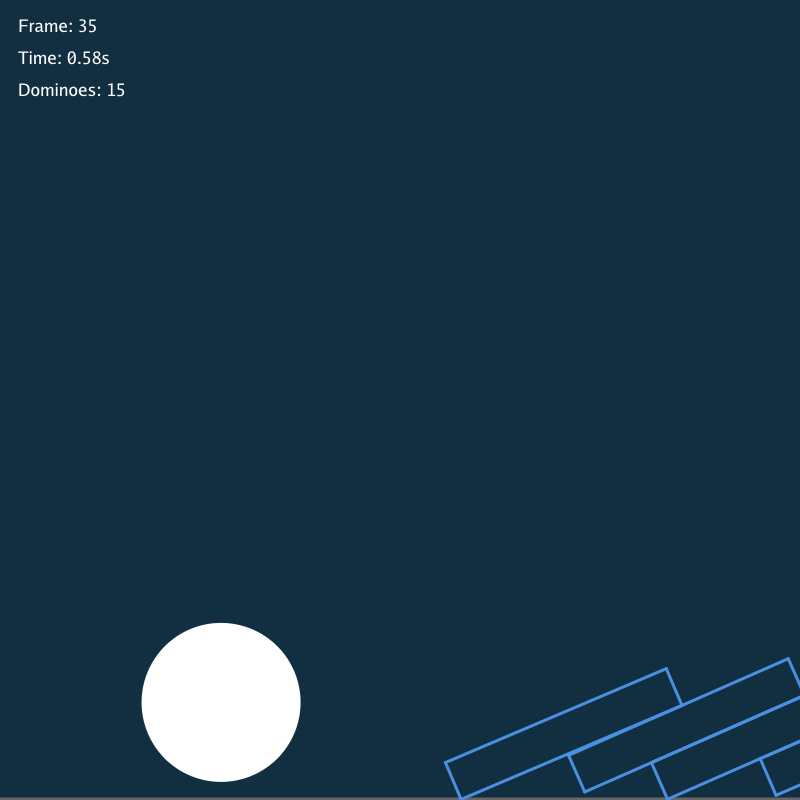
  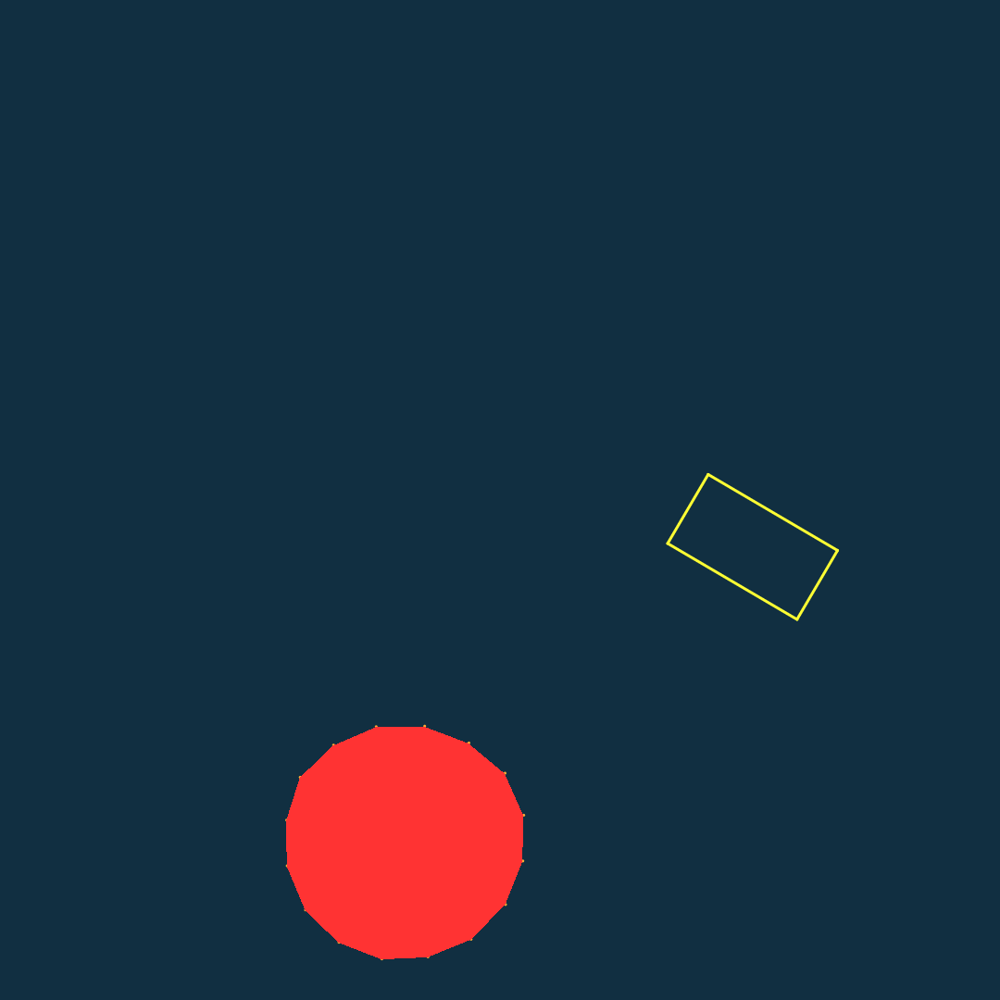
  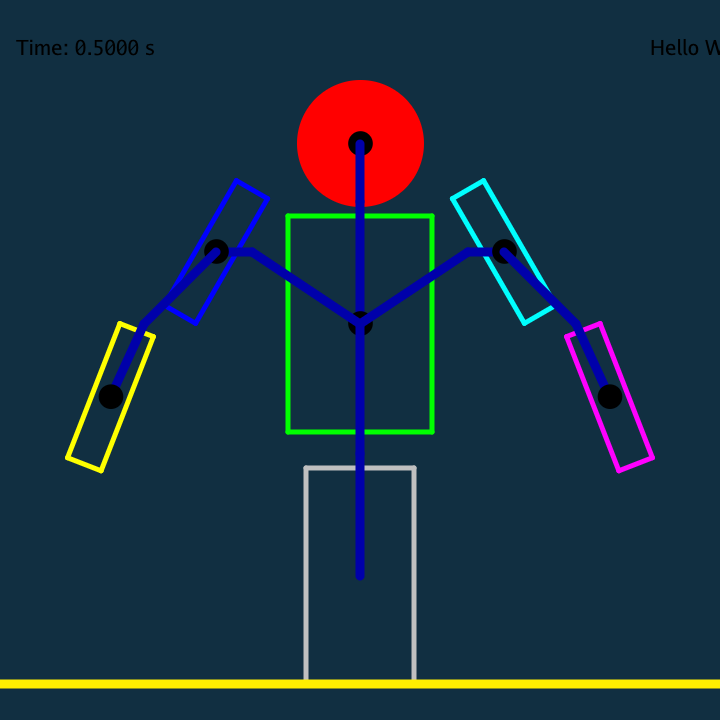
  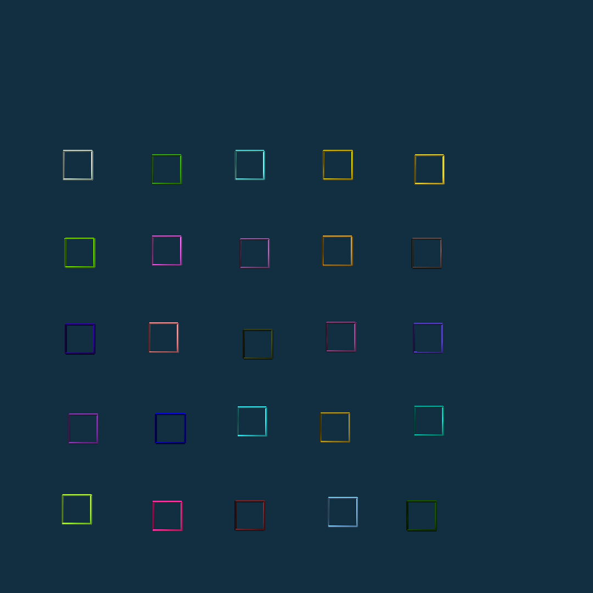
  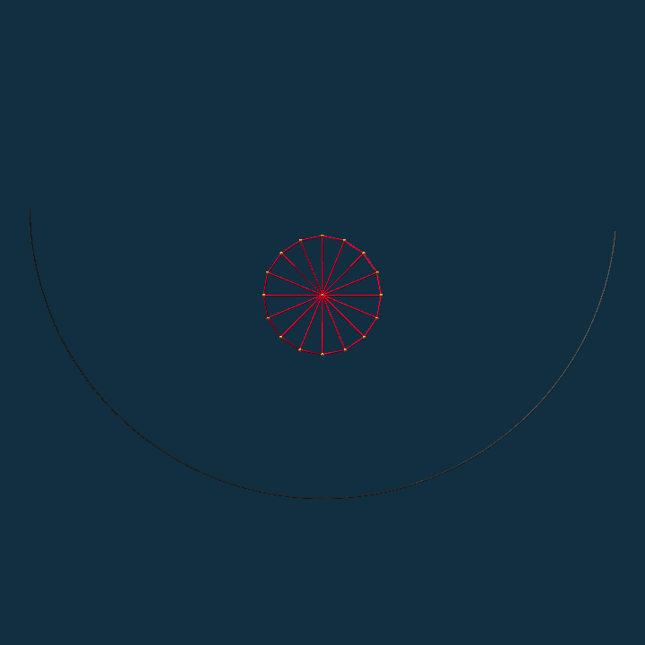
  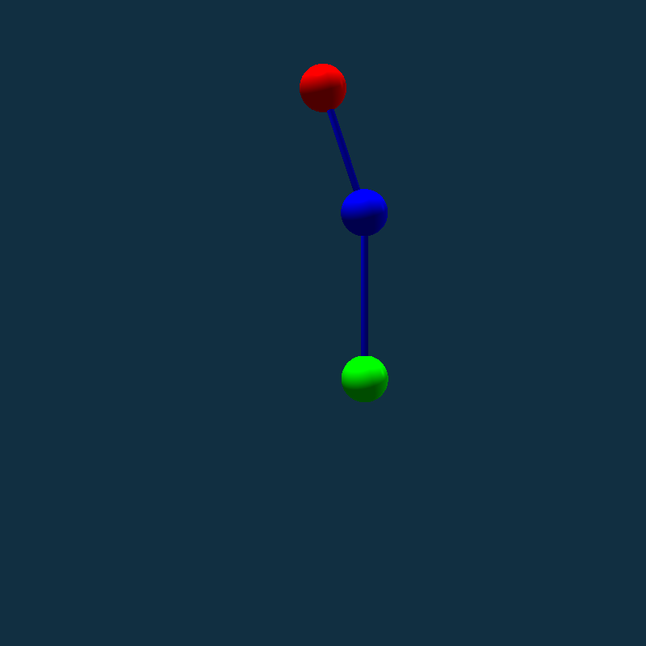
</p>

**35 scenes** — full catalog: [docs/gallery/README.md](docs/gallery/README.md)

Regenerate locally: `python scripts/capture_gallery.py`

## Documentation

- [Learning world models](learning/README.md)
- [Theory & implementation (中文)](docs/THEORY_AND_IMPLEMENTATION.md)
- [Contributing](CONTRIBUTING.md)

## Project layout

```
FlatWorld/
├── flatworld/          # Core engine
│   ├── explicitloop.py # Main simulation loop
│   ├── mixedcontact.py # Batched FEM / spring / ground contact
│   ├── femspringmanager.py
│   ├── rigidmanager.py # Rigid SAT / PGS / batched ground contact
│   └── sat.py          # 2D box–box SAT
├── learning/           # StateLeWM world model + PushToGoal CEM
├── game/               # raylib prototype (python -m game)
├── test2D/             # 2D examples & pytest suite
└── docs/
```

## Third-party dependencies

| Package | License | Used for |
|---------|---------|----------|
| [NVIDIA Warp](https://github.com/NVIDIA/warp) | Apache-2.0 | GPU/CPU kernels |
| numpy | BSD | Arrays |
| meshio | MIT | `.msh` / `.vtu` via `FEMesher` |
| matplotlib | PSF | Viewer / plots |
| [raylib](https://github.com/electronstudio/raylib-python-cffi) (optional) | zlib | `python -m game` |

## License

Copyright 2025-2026 Dongyu Liu

Licensed under the [Apache License, Version 2.0](LICENSE).

---

# Flat World (中文)

基于 **NVIDIA Warp** 的 **2D** 实时物理仿真引擎，支持刚体、有限元（FEM）、弹簧-质量系统，以及三种地面表示（解析平面、高度场、体素网格）。

## 功能概览

| 模块 | 说明 |
|------|------|
| 有限元 | 显式动力学，线性弹性 / Neo-Hookean / J2 塑性 |
| 刚体 | 球、盒、胶囊、网格；2D SAT；PGS 冲量求解 |
| 地面 | `GroundDomain`、`HeightFieldDomain`、`VoxelGridDomain`；刚体与 FEM 接触均为 batched Warp kernel |
| 关节 | 转动、焊接、滑动、球铰 |
| 接触 | `mixedcontact.py` FEM/弹簧惩罚接触；`rigidmanager.py` 刚体 PGS |

## 安装与运行

```bash
pip install -r requirements.txt
pip install -e .
```

读 `.msh` / `.vtu` 需要 `meshio`；Spirit Push 游戏需要 `raylib`。

无显示器环境（CI）请设置：

```bash
set HEADLESS=1          # Windows
export HEADLESS=1       # Linux / macOS
pytest test2D -q
```

`test2D/` 下共 51 个 pytest 模块。

## 图库 Gallery

`test2D` 可渲染案例的实时截图（共 35 张）：

<p align="center">
  
  
  
  
  
  
</p>

完整列表：[docs/gallery/README.md](docs/gallery/README.md) · 重新生成：`python scripts/capture_gallery.py`

## 学习世界模型

完整说明（架构、损失、评测）：**[learning/README.md](learning/README.md)**。

[`learning/`](learning/README.md) 是在 FlatWorld 里训练的轻量 **状态 + 触觉条件潜变量世界模型**（StateLeWM）：随机推挤采集、潜变量动力学、CEM 规划 PushToGoal。模型 **32.1 万参数**。当前成功率（50 局，CEM H=32）：最左 **98%** / 最右 **96%**，随机 **96%**。默认权重：`learning/checkpoints/push_game/best.pt`。

<p align="center">
  
</p>

<p align="center">
  
</p>

### 同一套配方的另外两个案例：Two-room 与 Reacher

**Two-room** 和 **Reacher** 是同一套 LeWM 配方（无目标交互里学一个潜变量世界模型，再用
CEM 规划）的另外两个案例，不是新架构。它们复用完全相同的 StateLeWM 编码器 / 预测器 /
损失，只有**数据**和 typed-edge + (x, y, θ) 读出变了。Two-room 是带 ~0.40 m 门洞
的隔墙房间，目标永远在 EE 起始房间的另一侧，规划必须自己找到门；Reacher 是重力二连杆臂，
动作为 PD 关节角目标。

| 场景 | 成功率（50 局，seed 1000） | tol / vel | 权重 |
|------|--------------------------|-----------|------|
| PushToGoal（最左 / 最右 / 随机） | 98 / 96 / 96 % | 0.08 m / 0.08 m/s | `learning/checkpoints/push_game` |
| Two-room | **49/50 = 98%** | 0.10 m / 0.15 m/s | `learning/checkpoints/two_room` |
| Reacher | **48/50 = 96%** | 0.06 m / 0.18 m/s | `learning/checkpoints/reacher` |

Two-room 与 Reacher 正是像素系 LeWM 一脉所用的同两个基准任务，任务名可对齐，因此成功率可以
并排参考：

| 方法 | Two-Room | Reacher |
|------|----------|---------|
| **StateLeWM**（本仓库，状态 + EE 触觉） | **98** | **96** |
| LeWM | 87 | 86 |
| Fast-LeWM | 98 | 88 |
| DINO-WM | 100 | 79 |
| PLDM | 97 | 78 |

数字为成功率（%）。StateLeWM 是本仓库实测（50 局 / 10 局）；LeWM 系各行是它们
**各自实现**的 Two-Room / Reacher（像素观测、各自的局数与成功阈值）的公开成绩（LeWM:
Maes et al., 2026；Fast-LeWM: Gao & Xu, 2026；DINO-WM: Zhou et al., 2025；PLDM: Sobal et
al., 2025）。这是量级参照，不是受控对比。

## Spirit Push 游戏

用世界模型当「精灵」的 raylib 原型：点要推的物体和落点，CEM 规划力。前五关是固定战役（1 个圆形末端执行器 + 3 箱 + 2 球）；第 6 关起按种子**随机出关**（重试同一关不变，跳过/过关是新布局）。

```bash
python -m game
```

金色是目标，红色碰一次就重来，星星是终点。右侧滑条改弹性 / 摩擦力 / 尺寸。

<p align="center">
  
</p>

<p align="center">
  
  
  
</p>

截图再生成：`python scripts/capture_game.py`。

## 文档

- [学习世界模型](learning/README.md)
- [理论与实现](docs/THEORY_AND_IMPLEMENTATION.md)
- [贡献指南](CONTRIBUTING.md)

## 开源协议

本项目采用 [Apache License 2.0](LICENSE)。
